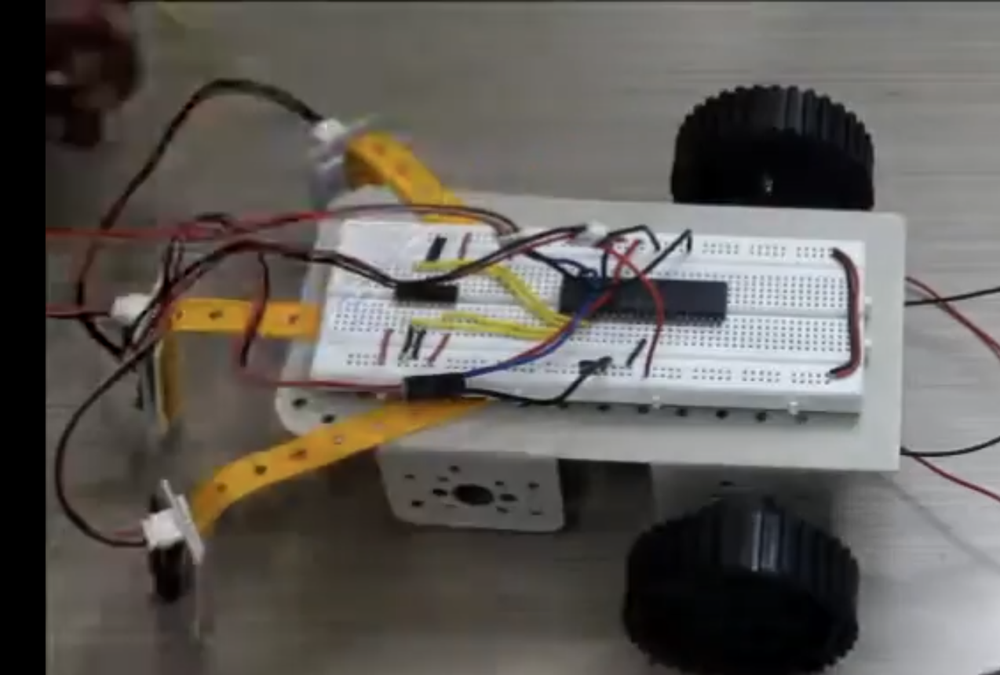
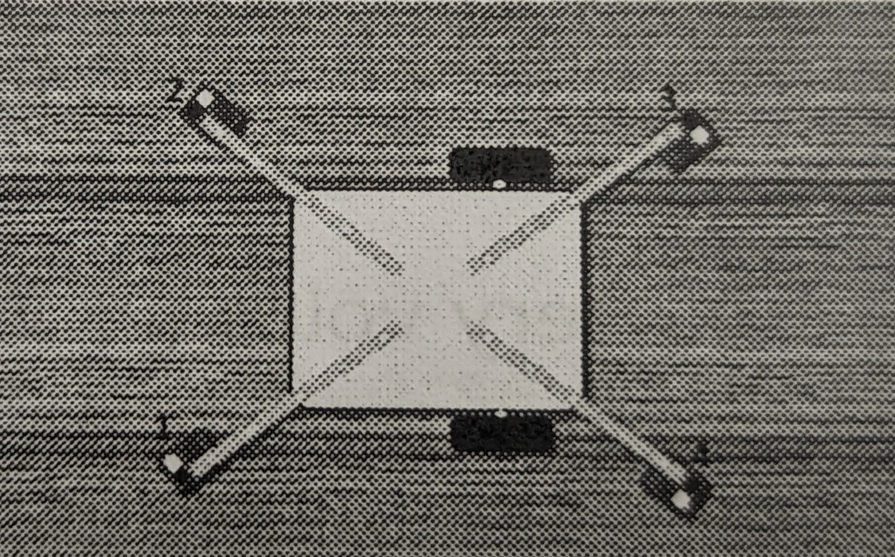
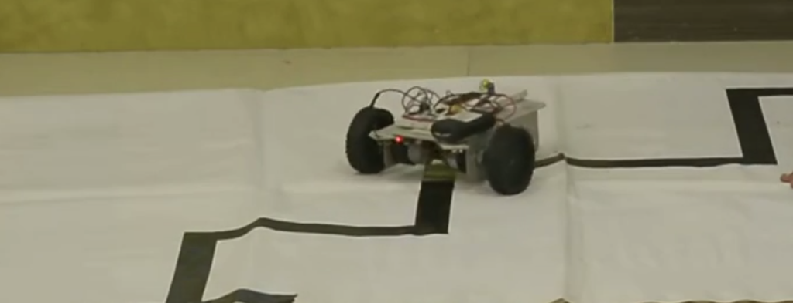

## About Me

I am a Mechatronics Specialist with a Bachelor’s degree in Electrical and Electronics Engineering and a Postgraduate Certificate in Industrial Automation. Passionate about robotics, I excel in integrating both hardware and software systems. My hands-on experience includes ROS 2, Gazebo simulation, Python programming, Fusion 360 CAD modeling, and embedded microcontroller development. I aspire to contribute as a versatile roboticist building intelligent autonomous systems.

---

# Featured Projects

## Obstacle Avoidance with LiDAR (ROS 2 + Gazebo)

This project simulates a two-wheeled differential drive robot equipped with a LiDAR sensor that autonomously avoids obstacles within a Gazebo environment. Using ROS 2 Humble and Gazebo Classic, the robot processes real-time laser scan data from the `/scan` topic and publishes velocity commands to `/cmd_vel` for smooth navigation. The setup includes a custom URDF/Xacro model and a detailed Gazebo world representing a cluttered environment.

- Developed custom robot model and integrated LiDAR sensor.
- Implemented obstacle detection and avoidance algorithms in Python.
- Designed simulation environment replicating real-world navigation challenges.

**Challenges faced:**

- Ensuring accurate sensor data processing and filtering for reliable obstacle detection.
- Tuning velocity commands to achieve smooth and safe robot movements.
- Configuring Gazebo plugins and model files for correct sensor simulation.

**Learning outcomes:**

- Mastered ROS 2 topics and message handling for real-time sensor and control data.
- Gained experience in Gazebo robot modeling and simulation environment setup.
- Enhanced understanding of autonomous navigation using LiDAR-based perception.

**Skills & tools used:**

- ROS 2 Humble, Python
- Gazebo Classic Simulation
- URDF / Xacro Robot Description
- LiDAR sensor integration
- Ubuntu Linux, Visual Studio Code

  <video controls>
    <source src="assets/images/Obstacle_Avoidance.mp4" type="video/mp4" />
    Your browser does not support the video tag.
  </video>

  [GitHub Repository](https://github.com/parveezsyed28/obstacle_avoidance_lidar)

---

## ROS 2 Bot Description

This project features a custom-designed two-wheeled robot created using Fusion 360 and described with URDF/Xacro files. The model includes detailed STL meshes and integrates Gazebo plugins such as the differential drive controller for realistic motion simulation. The robot is simulated within Gazebo to test movement and sensor plugins, providing a solid foundation for further ROS 2 robotic development.

- Designed mechanical components in Fusion 360 and exported STL meshes.
- Created accurate URDF and Xacro descriptions with sensors and plugins.
- Simulated robot kinematics and sensor data in Gazebo.

**Challenges faced:**

- Managing mesh file references and ensuring proper visualization in Gazebo.
- Configuring differential drive plugin parameters for smooth robot control.
- Synchronizing URDF with Gazebo-specific XML extensions.

**Learning outcomes:**

- Gained experience in robot modeling and simulation workflows.
- Understood integration of hardware CAD designs with ROS 2 simulation environments.
- Developed skills in robot plugin configuration for Gazebo.

**Skills & tools used:**

- Fusion 360 CAD
- ROS 2 Humble, Gazebo Classic
- URDF / Xacro Robot Modeling
- STL Meshes and Gazebo Plugins
- Python, Linux

  
  <video controls>
    <source src="assets/images/robot_teleop.mp4" type="video/mp4" />
    Your browser does not support the video tag.
  </video>

  [GitHub Repository](https://github.com/parveezsyed28/ros2_bot_description)

---

## Turtlesim Shape Drawer

A ROS 2 Python node that controls the turtlesim to draw geometric shapes based on interactive user input. It includes service calls to reset the turtlesim, allowing repeated shape drawing. This project helps demonstrate ROS 2 communication concepts like publishers, subscribers, and service clients in a simple and visual way.

- Implemented publisher and subscriber nodes for turtle velocity commands.
- Handled CLI input and reset services in ROS 2.
- Designed code modularity for ease of extending shapes.

**Challenges faced:**

- Synchronizing service calls and publisher commands for smooth turtle control.
- Managing timing and velocity parameters for precise shape drawing.

**Learning outcomes:**

- Deepened understanding of ROS 2 communication patterns.
- Improved ability to build interactive robotic applications.
- Practiced Python scripting in ROS 2 nodes.

**Skills & tools used:**

- ROS 2 Humble, Python
- Turtlesim Simulator
- Publisher/Subscriber and Service Calls

  <video controls>
    <source src="assets/images/Turtlesim.mp4" type="video/mp4" />
    Your browser does not support the video tag.
  </video>

---

## Obstacle Avoider Robot

This microcontroller-based robot avoids obstacles using IR sensors programmed with Embedded C on the ATmega16. The robot detects obstacles using front-facing IR sensors and controls motion via an L293D motor driver. The design emphasizes robust sensor integration and real-time control logic on limited hardware.

- Implemented IR sensor interfacing and obstacle detection logic.
- Controlled motor driver signals with embedded C code.
- Developed chassis and hardware layout optimized for sensor placement.

**Challenges faced:**

- Ensuring sensor readings were reliable under different lighting conditions.
- Timing motor control signals to avoid jerky movement.
- Managing power distribution to motors and sensors effectively.

**Learning outcomes:**

- Built expertise in embedded C programming for real-time control.
- Gained practical experience in sensor integration on microcontrollers.
- Understood motor driver interfacing and motion control.

**Skills & tools used:**

- Embedded C, ATmega16
- IR Sensors, L293D Motor Driver
- PCB Design & Hardware Integration

  
  

---

## Table Top Robot

This robot is designed to detect table edges and avoid falling by using IR sensors programmed on the ATmega16 microcontroller. It continuously monitors edge proximity and maneuvers accordingly to maintain stability on the table surface.

- Used real-time IR sensor data for edge detection.
- Embedded control logic to adjust robot motion based on sensor feedback.

**Challenges faced:**

- Achieving fast and reliable edge detection for safe operation.
- Balancing sensor sensitivity and false positive reduction.

**Learning outcomes:**

- Mastered edge detection concepts with IR sensors.
- Refined embedded control strategies for safety features.

**Skills & tools used:**

- Embedded C, ATmega16
- IR Sensors for Edge Detection
- Real-time Embedded Control

  

---

## Line Follower Robot

A robot designed to follow a black line using bottom-mounted IR sensors. The control system uses sensor feedback to maintain alignment on the path. The robot was developed with embedded C programming on the ATmega16 microcontroller, utilizing analog sensor input for reliable line detection.

- Implemented analog IR sensor interfacing for line detection.
- Developed control logic for real-time path following.
- Compact and efficient hardware design.

**Challenges faced:**

- Ensuring accurate sensor readings without noise filtering.
- Fine-tuning sensor placement for reliable line detection.
- Implementing smooth motor control to follow curves.

**Learning outcomes:**

- Gained understanding of sensor-based path following.
- Applied embedded control techniques in constrained environments.

**Skills & tools used:**

- Embedded C, ATmega16
- IR Sensors, Analog Signal Processing
- Motor Driver Control

  
  

---

## ADC-Based Robot (Analog to Digital Conversion)

This advanced robot integrates multiple sensors for obstacle avoidance, cliff detection, and black line following. It also includes dynamic speed control using a potentiometer connected to the ATmega16 microcontroller's ADC module. The robot uses analog sensor inputs to adapt motor speed and navigate various environments.

- Utilizes front, top, left, and right IR sensors for comprehensive environment awareness.
- Speed control implemented via ADC reading from a trimpot.
- Embedded C programming for real-time sensor processing and motor control.

**Challenges faced:**

- Balancing sensor readings and motor control for smooth navigation.
- Implementing accurate ADC sampling and PWM motor speed control.
- Hardware integration of multiple sensors with the microcontroller.

**Learning outcomes:**

- Mastered ADC usage in microcontrollers for analog sensor data.
- Developed complex embedded systems integrating multiple sensors.
- Improved skills in hardware-software co-design.

**Skills & tools used:**

- Embedded C, ATmega16 ADC module
- IR Sensors, Potentiometer for Speed Control
- L293D Motor Driver
- Real-time Embedded Systems

  

---

# Skills & Tools

- ROS 2 Humble, Gazebo Classic Simulation
- URDF / Xacro Robot Description
- Python, Embedded C Programming
- ATmega16 Microcontroller, L293D Motor Driver, IR Sensors
- Fusion 360 CAD Modeling, KiCad PCB Design
- Linux (Ubuntu), Git & GitHub

---

# Contact

- Email: [parveezbanu.s@gmail.com](mailto:parveezbanu.s@gmail.com)
- GitHub: [github.com/parveezsyed28](https://github.com/parveezsyed28)
- LinkedIn: [linkedin.com/in/parveez-banu-syed-azizuddin2807](https://www.linkedin.com/in/parveez-banu-syed-azizuddin2807)
