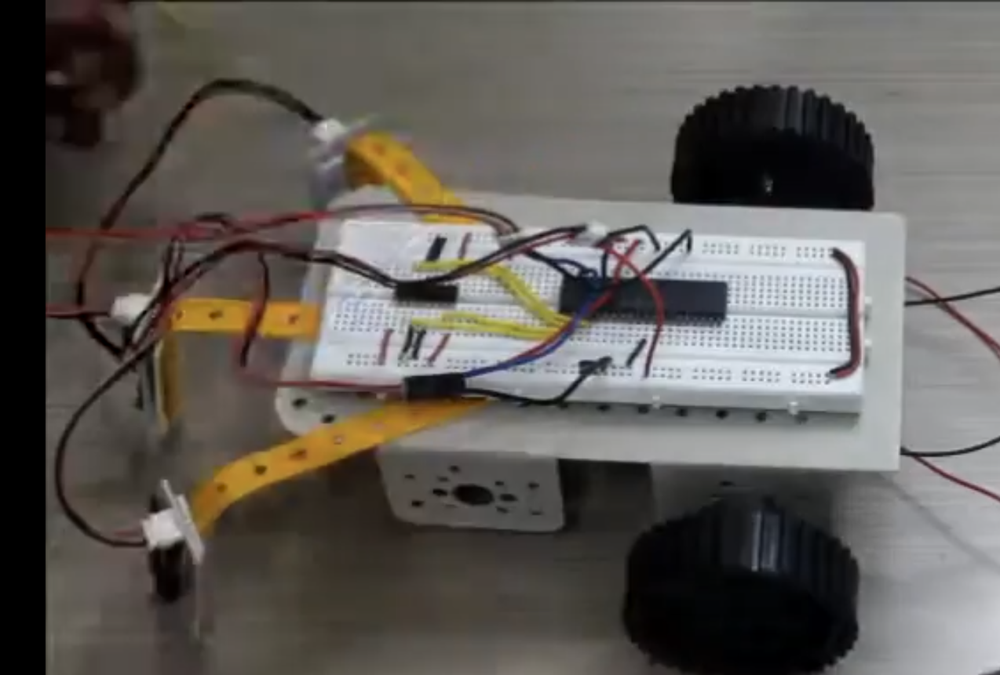
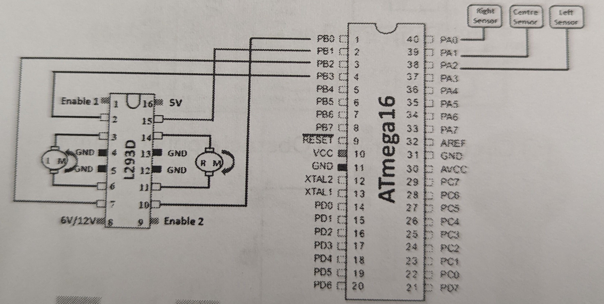
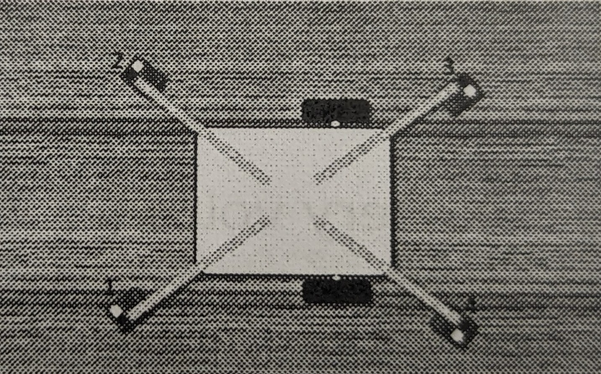
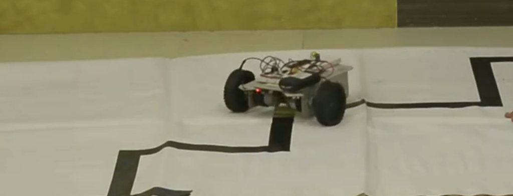
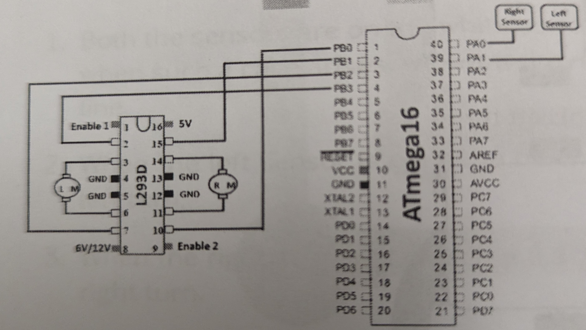
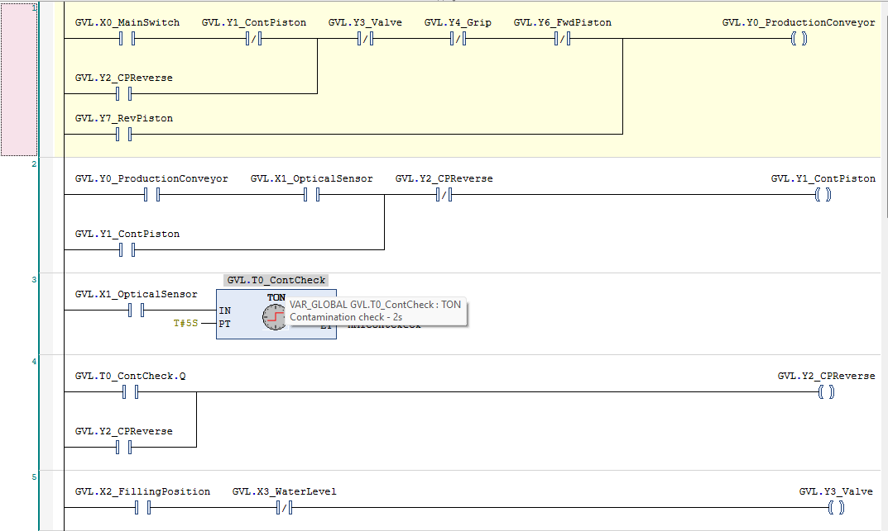
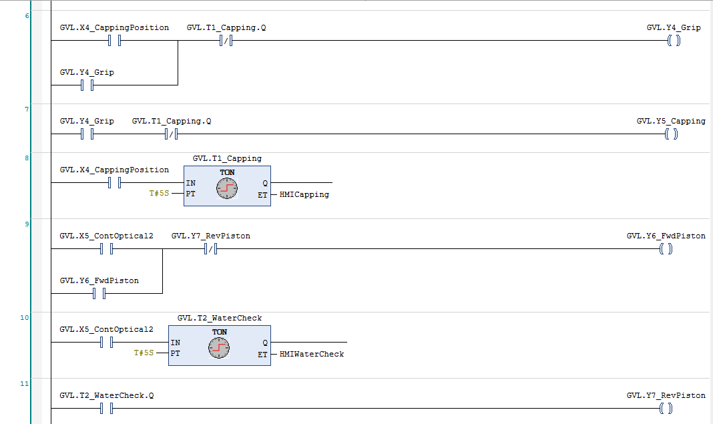
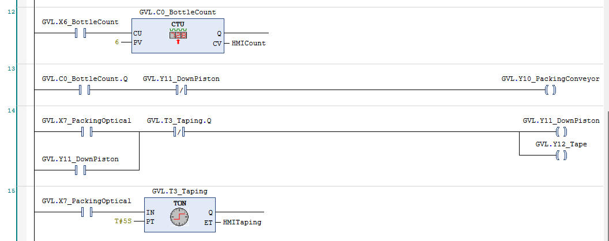

<!-- ========================= -->
<!--       TOP NAV MENU        -->
<!-- ========================= -->

<nav class="top-nav">
  <ul>
    <li><a href="#home">Home</a></li>
    <li><a href="#ros2-projects">ROS2 Projects</a></li>
    <li><a href="#embedded-projects">Embedded Projects</a></li>
    <li><a href="#automation-projects">Industrial Automation</a></li>
    <li><a href="#skills">Skills</a></li>
    <li><a href="#contact">Contact</a></li>
  </ul>
</nav>

---

<h1 id="home" class="section-title">👋 Welcome</h1>

Hi! I'm **Parveez Banu Syed Azizuddin**. Welcome to my portfolio — a collection of projects I’ve been working on while exploring industrial automation and control systems. With a background in Electrical and Electronics Engineering and experience as a Mechatronics Engineer, I’ve been drawn to how systems behave in real-world conditions — especially how sensors, control logic, and timing come together to make something work reliably. I’ve been building projects across PLCs, embedded systems, and ROS 2, trying to understand not just how to make things work, but how to make them stable and predictable.

---

<h1 id="ros2-projects" class="section-title">🤖 ROS2 Projects</h1>

## 🟦 **Wall Following Robot (ROS 2 + Gazebo)**

  

    A mobile robot that uses LiDAR data to maintain a consistent distance from walls while navigating corridors and turns without human input. The challenge was handling unstable readings at corners and openings, where simple control logic caused oscillations and drift. I found that stabilizing distance control and prioritizing side-wall feedback produced significantly smoother and more reliable motion.
  

 

    <strong>Skills & Tools:</strong>
  

  

    ROS2
    Python
    Gazebo Classic
    URDF/Xacro
    Fusion 360
  

  

    <video controls>
      <source src="assets/images/Wall_follower.mp4" type="video/mp4" />
    </video>
     
    <a class="github-link" href="https://github.com/parveezsyed28/Wall-Following-Robot-with-LiDAR" target="_blank">GitHub</a>
  

---

## 🟦 **Obstacle Avoidance Robot (ROS 2 + Gazebo)**

  
  

    A differential-drive robot that detects and avoids obstacles in real time using LiDAR data in a simulated environment. The challenge was translating noisy sensor input into smooth motion without abrupt stops or erratic behavior. I found that filtering scan data and tuning control loop timing had a greater impact on stability than the avoidance logic itself.
  

 
<strong>Skills & Tools:</strong>

  ROS 2 Humble
  Python
  Gazebo Classic
  URDF/Xacro
  LiDAR 
  Ubuntu

  

    <video controls>
      <source src="assets/images/Obstacle_Avoidance.mp4" type="video/mp4" />
    </video>
     
    <a class="github-link" href="https://github.com/parveezsyed28/obstacle_avoidance_lidar" target="_blank">GitHub</a>
  

---

## 🟦 **Robot Description & Simulation (ROS2 + Fusion 360)**

  

     A custom-designed two-wheeled robot modeled in CAD and simulated in Gazebo using URDF/Xacro with integrated plugins. The challenge was aligning mechanical design, URDF structure, and simulation parameters so the robot behaved realistically. I learned that correct plugin configuration and consistent frame definitions are critical for stable motion and accurate simulation.
  

 
 
<strong>Skills & Tools:</strong>

   ROS2 Humble
  Python
  Gazebo Classic
  URDF/Xacro
  Fusion 360
  STL Meshes
  Ubuntu

  

    <video controls>
      <source src="assets/images/robot_teleop.mp4" type="video/mp4" />
    </video>
     
    <a class="github-link" href="https://github.com/parveezsyed28/ros2_bot_description" target="_blank">GitHub</a>
  

---

## 🟦 **Turtlesim Geometric Shape Drawer (ROS 2 Python)**

  

    A ROS 2 Python node that controls a simulated robot to draw geometric shapes based on user input. The challenge was coordinating service calls and velocity commands to maintain precise motion without timing conflicts. I learned how synchronization between communication patterns directly affects motion accuracy, even in simple systems.
  

  
<strong>Skills & Tools:</strong>

  ROS2 Humble
  Python
   Turtlesim
  Publisher/Subscriber
  Service Calls

  

    <video controls>
      <source src="assets/images/Turtlesim.mp4" type="video/mp4" />
    </video>
     
    <a class="github-link" href="https://github.com/parveezsyed28/user_input_turtle_shape" target="_blank">GitHub</a>
  

---

<h1 id="embedded-projects" class="section-title">🔧 Embedded Projects</h1>

## 🟦 **ADC-Based Multi-Behaviour Robot**

  

    A microcontroller-based robot that combines obstacle avoidance, edge detection, and line following with dynamic speed control using ADC input. The challenge was balancing multiple sensor inputs and control behaviors on limited hardware without causing conflicts or unstable motion. I found that prioritizing behaviors and tuning response timing was key to achieving consistent performance.
  

<strong>Skills & Tools:</strong>

 

   Embedded C
  ATmega16
  IR Sensors
  L293D Motor Driver
  Potentiometer
  7805 Voltage Regulator
  IC555 Timer
  PWM Control
  ADC

  <a class="github-link" href="https://github.com/parveezsyed28/ADC_speed_controlled_robot" target="_blank">GitHub</a>

---

## 🟦 **Obstacle Avoider Robot**

  

    A real-time obstacle-avoiding robot built on a microcontroller using IR sensors and direct motor control. The challenge was ensuring reliable sensor detection under varying conditions while maintaining smooth movement. I learned that simple, well-timed control logic is more effective than complex decision-making on constrained systems.
  

<strong>Skills & Tools:</strong>

 

  Embedded C
  ATmega16
  IR Sensors
  L293D Motor Driver
  PCB Design
  Hardware Integration
  7805 Voltage Regulator
  IC555 Timer

   <!-- Side-by-side images -->
  

    
    
  

  <a class="github-link" href="https://github.com/parveezsyed28/obstacle_avoider_robot" target="_blank">GitHub</a>

---

## 🟦 **Table Top Robot**

  

   A robot that detects table edges and prevents falls by continuously monitoring IR sensor feedback. The challenge was achieving fast and reliable detection without false     triggers that could interrupt motion. I found that tuning sensor thresholds and response timing was critical for stable and safe operation.
  

<strong>Skills & Tools:</strong>

 

   Embedded C
  ATmega16
  IR Sensors
  Real-time Embedded Control

>

  

    
  

  <a class="github-link" href="https://github.com/parveezsyed28/table_top_robot" target="_blank">GitHub</a>

---

## 🟦 **Line Follower Robot**

  

   A robot that follows a path using IR sensors to continuously correct its trajectory. The challenge was maintaining stability through turns and recovering quickly from deviations without overshooting. I learned that balancing correction speed and control response is key to smooth and accurate tracking.
  

  
<strong>Skills & Tools:</strong>

    

  Embedded C
  ATmega16
  IR Sensors
  L293D Motor Driver

 

    
    
  

  <a class="github-link" href="https://github.com/parveezsyed28/line_follower_robot" target="_blank">GitHub</a>

<h1 id="automation-projects" class="section-title">🏭 Industrial Automation</h1>

<h2>🔹 Industrial Robotics</h2>

<h3>ABB RobotStudio + Teach Pendant Projects</h3>

<h3>Pick & Place / Sorting Simulation</h3>

An industrial robot simulation that performs pick-and-place and sorting operations with precise motion control. The challenge was ensuring accurate positioning across varying object conditions while avoiding collisions. I learned how tool center point (TCP) configuration directly impacts repeatability and motion precision.

  

<strong>Tools & Environment:</strong> ABB RobotStudio, ABB Teach Pendant, TCP configuration</strong>

<strong>Skills:</strong>

  ABB RobotStudio
  TCP Configuration
  Motion Control
 

<h3>Drawing / Pattern Simulation</h3>

A robotic system programmed to execute precise geometric drawing patterns. The challenge was maintaining smooth trajectories across curves and corners without accumulating positional error. I found that speed synchronization and TCP tuning are critical for consistent path accuracy.

  

<strong>Tools & Environment:</strong> ABB RobotStudio, ABB Teach Pendant, TCP configuration

<strong>Skills:</strong>

  ABB RobotStudio
  Motion Control
  Trajectory Planning
 

#### Nachi Robot Teach Pendant Projects

<h3>Pick & Place</h3>

A teach pendant–programmed robot performing pick-and-place and color sorting tasks. The challenge was integrating sensor feedback with motion sequences while maintaining reliable positioning. I learned how structured motion sequencing improves repeatability and reduces errors in automated tasks.

<strong>Tools & Environment:</strong> Nachi Teach Pendant, TCP configuration, Sensor Integration, Motion Control 

<strong>Skills & Tools:</strong>

  Nachi Teach Pendant
  TCP Configuration
  Motion Control
  Sensor Integration
  

<h3>Color Sorting</h3>

A teach pendant–programmed robot that sorts objects based on color by integrating sensor feedback with motion sequences. The challenge was aligning detection with precise positioning so that objects were consistently picked and placed without misalignment. I found that accurate TCP calibration and structured motion sequencing were key to reducing sorting errors and improving repeatability.

<strong>Tools & Environment:</strong> Nachi Teach Pendant, TCP configuration, Sensor Integration, Motion Control 

<strong>Skills & Tools:</strong>

   Nachi Teach Pendant
  TCP Configuration
  Motion Control
  Sensor Integration
  

<h3>Drawing / Pattern Making</h3>

A robot programmed to create geometric patterns using teach pendant control and precise trajectory execution. The challenge was maintaining smooth motion across curves and corners without introducing positional errors over repeated cycles. I found that synchronizing speed, orientation, and TCP calibration was essential for achieving consistent and accurate patterns.

<strong>Tools & Environment:</strong> Nachi Teach Pendant, TCP configuration

<strong>Skills & Tools:</strong>

  Nachi Teach Pendant
  TCP Configuration
  Motion Control
  Trajectory Planning
 

### 🔹 PLC Projects

<h3>Water Treatment Plant Backwash Automation</h3>

A PLC-based system that automates pump and valve sequencing for a backwash process with interlocks and fail-safes. The challenge was designing safe and reliable sequences where incorrect timing could damage equipment. I learned that clear state control and interlock design are essential for fault-tolerant industrial systems.
  

<strong>Tools & Environment:</strong> RSLogix 500 / Studio 5000, Ladder Logic, PLC sensors and actuators

<strong>Skills & Tools:</strong>

 PLC
  Allen Bradley
  Ladder Logic
  Structured Text
  Functional Block Diagram (FBD)
 

<h3>Automatic Water Filling System</h3>

A 7-stage automated filling system with sensor-based sequencing, timers, and HMI monitoring. The challenge was managing stage transitions without conflicts while maintaining accurate timing and synchronization. I found that properly structured logic with timers, counters, and interlocks is critical for stable and scalable automation.

<strong>Tools & Environment:</strong> CODESYS V3, Ladder Logic, CODESYS Visualization (HMI), Software Simulation

  <!-- HMI Video -->
  
<strong>HMI Simulation Demo:</strong>

  
<em>Demo: Real-time monitoring and control of the 7-stage bottle filling process</em>

  <video controls>
    <source src="assets/images/Automatic_Bottle_Filling.mp4" type="video/mp4" />
  </video>
    
  <!-- Ladder Logic Screenshots -->
  
<strong>Ladder Logic Implementation:</strong>

  
<em>Sequential control logic divided into stages</em>

  

    
    
    
  

<strong>Skills & Tools:</strong>

  PLC
  CODESYS V3
  Ladder Logic
  HMI Development
  Simulation

---

<h1 id="skills" class="section-title">🧠 Skills</h1>

<link rel="stylesheet" href="https://cdn.jsdelivr.net/npm/aos@2.3.4/dist/aos.css" />

  ROS2
  Gazebo
  RViz
  Python
  Embedded C
  Arduino
  PLC (Allen Bradley / Delta)
  ABB RobotStudio
  Nachi Teach Pendant
  Fusion 360
  Electromechanical Troubleshooting

  

---

## 📬 Contact

  
📧 <a href="mailto:parveezbanu.s@gmail.com">parveezbanu.s@gmail.com</a>

  
🌐 <a href="https://parveezsyed28.github.io" target="_blank">Portfolio</a>

  
🔗 <a href="https://github.com/parveezsyed28" target="_blank">GitHub</a>

  
💼 <a href="https://linkedin.com/in/parveez-banu2807" target="_blank">LinkedIn</a>

  
📍 Toronto, Canada

---

<!-- ========================= -->
<!--  FLOATING RETURN TO TOP   -->
<!-- ========================= -->

<button id="topBtn" title="Go to top">▲</button>

