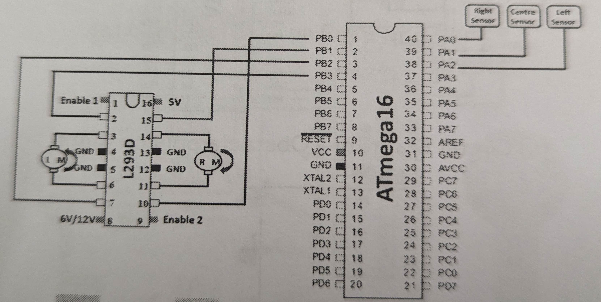

  <h1>Parveez Banu Syed Azizuddin</h1>
  
Robotics Enthusiast | ROS2 Developer

## About Me

Welcome to my robotics portfolio! I am passionate about creating intelligent autonomous systems by combining hardware and software. Here you will find my featured projects showcasing my skills in ROS 2, Gazebo, embedded systems, and CAD modeling.

---

## Featured Projects

### Wall Following Robot (ROS 2 + Gazebo)

This robot autonomously follows walls using LiDAR data and ROS 2 nodes, simulated within a maze-like Gazebo environment. The robot processes real-time sensor data to maintain a stable distance from the walls.

**Challenges faced:**

- Maintaining consistent distance during tight corners with noisy sensor input.
- Filtering LiDAR data to reduce false detections.
- Tuning velocity commands for smooth navigation.

**Learning outcomes:**

- Developed sensor processing and feedback control skills.
- Improved ROS 2 node programming for real-time navigation.
- Gained experience with Gazebo simulation environments.

**Skills & tools used:**

ROS 2 Humble, Gazebo Classic, Python, LiDAR sensor integration

  <video controls>
    <source src="assets/images/Wall_follower.mp4" type="video/mp4" />
    Your browser does not support the video tag.
  </video>
   
  <a class="github-link" href="https://github.com/parveezsyed28/Wall-Following-Robot-with-LiDAR" target="_blank" rel="noopener">
    <svg viewBox="0 0 16 16" aria-hidden="true"><path fill-rule="evenodd" d="M8 0C3.58 0 0 3.58 0 8a8 8 0 005.47 7.59c.4.07.55-.17.55-.38 0-.19-.01-.82-.01-1.49-2 .37-2.53-.49-2.69-.94-.09-.23-.48-.94-.82-1.13-.28-.15-.68-.52-.01-.53.63-.01 1.08.58 1.23.82.72 1.21 1.87.87 2.33.66.07-.52.28-.87.51-1.07-1.78-.2-3.64-.89-3.64-3.95 0-.87.31-1.59.82-2.15-.08-.2-.36-1.02.08-2.12 0 0 .67-.22 2.2.82a7.67 7.67 0 012-.27 7.65 7.65 0 012 .27c1.53-1.04 2.2-.82 2.2-.82.44 1.1.16 1.92.08 2.12.51.56.82 1.28.82 2.15 0 3.07-1.87 3.75-3.65 3.95.29.25.54.73.54 1.48 0 1.07-.01 1.93-.01 2.2 0 .21.15.46.55.38A8 8 0 0016 8c0-4.42-3.58-8-8-8z"></path></svg>
    GitHub Repository
  </a>

---

### Obstacle Avoidance with LiDAR (ROS 2 + Gazebo)

A two-wheeled differential drive robot with LiDAR sensor to avoid obstacles autonomously in a Gazebo environment. Processes laser scan data and publishes velocity commands for smooth movement.

**Challenges faced:**

- Processing sensor data accurately for obstacle detection.
- Tuning smooth velocity commands.
- Configuring Gazebo plugins for sensor simulation.

**Learning outcomes:**

- Mastered ROS 2 message handling and sensor integration.
- Learned Gazebo robot modeling and environment design.
- Enhanced autonomous navigation understanding.

**Skills & tools used:**

ROS 2 Humble, Python, Gazebo Classic, URDF/Xacro

  <video controls>
    <source src="assets/images/Obstacle_Avoidance.mp4" type="video/mp4" />
    Your browser does not support the video tag.
  </video>
   
  <a class="github-link" href="https://github.com/parveezsyed28/obstacle_avoidance_lidar" target="_blank" rel="noopener">
    <svg viewBox="0 0 16 16" aria-hidden="true"><path fill-rule="evenodd" d="M8 0C3.58 0 0 3.58 0 8a8 8 0 005.47 7.59c.4.07.55-.17.55-.38 0-.19-.01-.82-.01-1.49-2 .37-2.53-.49-2.69-.94-.09-.23-.48-.94-.82-1.13-.28-.15-.68-.52-.01-.53.63-.01 1.08.58 1.23.82.72 1.21 1.87.87 2.33.66.07-.52.28-.87.51-1.07-1.78-.2-3.64-.89-3.64-3.95 0-.87.31-1.59.82-2.15-.08-.2-.36-1.02.08-2.12 0 0 .67-.22 2.2.82a7.67 7.67 0 012-.27 7.65 7.65 0 012 .27c1.53-1.04 2.2-.82 2.2-.82.44 1.1.16 1.92.08 2.12.51.56.82 1.28.82 2.15 0 3.07-1.87 3.75-3.65 3.95.29.25.54.73.54 1.48 0 1.07-.01 1.93-.01 2.2 0 .21.15.46.55.38A8 8 0 0016 8c0-4.42-3.58-8-8-8z"></path></svg>
    GitHub Repository
  </a>

---

### Robot Description and Simulation (Fusion 360 + ROS 2 + Gazebo)

Custom two-wheeled robot designed in Fusion 360, described in URDF/Xacro with STL meshes, integrated with Gazebo plugins for realistic simulation.

**Challenges faced:**

- Managing mesh references and visualization.
- Configuring differential drive plugins.
- Syncing URDF with Gazebo extensions.

**Learning outcomes:**

- Experience in CAD to ROS simulation pipeline.
- Robot plugin configuration in Gazebo.
- Integration of hardware models into software simulation.

**Skills & tools used:**

Fusion 360, ROS 2 Humble, Gazebo Classic, URDF/Xacro

  
  <video controls>
    <source src="assets/images/robot_teleop.mp4" type="video/mp4" />
    Your browser does not support the video tag.
  </video>
   
  <a class="github-link" href="https://github.com/parveezsyed28/ros2_bot_description" target="_blank" rel="noopener">
    <svg viewBox="0 0 16 16" aria-hidden="true"><path fill-rule="evenodd" d="M8 0C3.58 0 0 3.58 0 8a8 8 0 005.47 7.59c.4.07.55-.17.55-.38 0-.19-.01-.82-.01-1.49-2 .37-2.53-.49-2.69-.94-.09-.23-.48-.94-.82-1.13-.28-.15-.68-.52-.01-.53.63-.01 1.08.58 1.23.82.72 1.21 1.87.87 2.33.66.07-.52.28-.87.51-1.07-1.78-.2-3.64-.89-3.64-3.95 0-.87.31-1.59.82-2.15-.08-.2-.36-1.02.08-2.12 0 0 .67-.22 2.2.82a7.67 7.67 0 012-.27 7.65 7.65 0 012 .27c1.53-1.04 2.2-.82 2.2-.82.44 1.1.16 1.92.08 2.12.51.56.82 1.28.82 2.15 0 3.07-1.87 3.75-3.65 3.95.29.25.54.73.54 1.48 0 1.07-.01 1.93-.01 2.2 0 .21.15.46.55.38A8 8 0 0016 8c0-4.42-3.58-8-8-8z"></path></svg>
    GitHub Repository
  </a>

---

### Geometric Shape Drawer using Turtlesim (ROS 2)

A ROS 2 Python node that controls turtlesim to draw geometric shapes interactively. Demonstrates ROS 2 communication (publishers, subscribers, services).

**Challenges faced:**

- Synchronizing service calls and velocity commands.
- Timing and velocity tuning for precise shapes.

**Learning outcomes:**

- Improved ROS 2 communication skills.
- Python scripting for interactive robotics.
- Visualization with Turtlesim.

**Skills & tools used:**

ROS 2 Humble, Python, Turtlesim

  <video controls>
    <source src="assets/images/Turtlesim.mp4" type="video/mp4" />
    Your browser does not support the video tag.
  </video>
   
  <a class="github-link" href="https://github.com/parveezsyed28/user_input_turtle_shape" target="_blank" rel="noopener">
    <svg viewBox="0 0 16 16" aria-hidden="true"><path fill-rule="evenodd" d="M8 0C3.58 0 0 3.58 0 8a8 8 0 005.47 7.59c.4.07.55-.17.55-.38 0-.19-.01-.82-.01-1.49-2 .37-2.53-.49-2.69-.94-.09-.23-.48-.94-.82-1.13-.28-.15-.68-.52-.01-.53.63-.01 1.08.58 1.23.82.72 1.21 1.87.87 2.33.66.07-.52.28-.87.51-1.07-1.78-.2-3.64-.89-3.64-3.95 0-.87.31-1.59.82-2.15-.08-.2-.36-1.02.08-2.12 0 0 .67-.22 2.2.82a7.67 7.67 0 012-.27 7.65 7.65 0 012 .27c1.53-1.04 2.2-.82 2.2-.82.44 1.1.16 1.92.08 2.12.51.56.82 1.28.82 2.15 0 3.07-1.87 3.75-3.65 3.95.29.25.54.73.54 1.48 0 1.07-.01 1.93-.01 2.2 0 .21.15.46.55.38A8 8 0 0016 8c0-4.42-3.58-8-8-8z"></path></svg>
    GitHub Repository
  </a>

---

### ADC-Based Speed-Controlled Robot

Robot with multiple sensors for obstacle avoidance, cliff detection, and line following. Speed control through ADC potentiometer on ATmega16.

**Challenges faced:**

- Balancing sensor input and motor speed.
- Accurate ADC sampling and PWM control.
- Integrating multiple sensors with microcontroller.

**Learning outcomes:**

- Mastered ADC use in microcontrollers.
- Developed embedded sensor integration.
- Hardware-software co-design.

**Skills & tools used:**

Embedded C, ATmega16, ADC, IR sensors

   
  <a class="github-link" href="https://github.com/parveezsyed28/ADC_based_speed_controlled_robot" target="_blank" rel="noopener">
    <svg viewBox="0 0 16 16" aria-hidden="true"><path fill-rule="evenodd" d="M8 0C3.58 0 0 3.58 0 8a8 8 0 005.47 7.59c.4.07.55-.17.55-.38 0-.19-.01-.82-.01-1.49-2 .37-2.53-.49-2.69-.94-.09-.23-.48-.94-.82-1.13-.28-.15-.68-.52-.01-.53.63-.01 1.08.58 1.23.82.72 1.21 1.87.87 2.33.66.07-.52.28-.87.51-1.07-1.78-.2-3.64-.89-3.64-3.95 0-.87.31-1.59.82-2.15-.08-.2-.36-1.02.08-2.12 0 0 .67-.22 2.2.82a7.67 7.67 0 012-.27 7.65 7.65 0 012 .27c1.53-1.04 2.2-.82 2.2-.82.44 1.1.16 1.92.08 2.12.51.56.82 1.28.82 2.15 0 3.07-1.87 3.75-3.65 3.95.29.25.54.73.54 1.48 0 1.07-.01 1.93-.01 2.2 0 .21.15.46.55.38A8 8 0 0016 8c0-4.42-3.58-8-8-8z"></path></svg>
    GitHub Repository
  </a>

---

### Obstacle Avoider Robot

Microcontroller robot avoiding obstacles using IR sensors and L293D motor driver, programmed in Embedded C.

**Challenges faced:**

- Reliable IR sensor readings under various conditions.
- Smooth motor control timing.
- Effective power management.

**Learning outcomes:**

- Embedded C for real-time control.
- Sensor integration on microcontrollers.
- Motor driver interfacing.

**Skills & tools used:**

Embedded C, ATmega16, IR sensors, L293D

  
  

<a class="github-link" href="https://github.com/parveezsyed28/obstacle_avoider_robot" target="_blank" rel="noopener" style="display:block; text-align:center; margin-top:6px;">
  <svg viewBox="0 0 16 16" aria-hidden="true"><path fill-rule="evenodd" d="M8 0C3.58 0 0 3.58 0 8a8 8 0 005.47 7.59c.4.07.55-.17.55-.38 0-.19-.01-.82-.01-1.49-2 .37-2.53-.49-2.69-.94-.09-.23-.48-.94-.82-1.13-.28-.15-.68-.52-.01-.53.63-.01 1.08.58 1.23.82.72 1.21 1.87.87 2.33.66.07-.52.28-.87.51-1.07-1.78-.2-3.64-.89-3.64-3.95 0-.87.31-1.59.82-2.15-.08-.2-.36-1.02.08-2.12 0 0 .67-.22 2.2.82a7.67 7.67 0 012-.27 7.65 7.65 0 012 .27c1.53-1.04 2.2-.82 2.2-.82.44 1.1.16 1.92.08 2.12.51.56.82 1.28.82 2.15 0 3.07-1.87 3.75-3.65 3.95.29.25.54.73.54 1.48 0 1.07-.01 1.93-.01 2.2 0 .21.15.46.55.38A8 8 0 0016 8c0-4.42-3.58-8-8-8z"></path></svg>
  GitHub Repository
</a>

---

### Table Top Robot

Designed to detect table edges and avoid falls using IR sensors on ATmega16 microcontroller.

**Challenges faced:**

- Fast, reliable edge detection.
- Reducing false positives.

**Learning outcomes:**

- Mastered IR edge detection.
- Embedded safety control design.

**Skills & tools used:**

Embedded C, ATmega16, IR Sensors

  
   
  <a class="github-link" href="https://github.com/parveezsyed28/table_top_robot" target="_blank" rel="noopener">
    <svg viewBox="0 0 16 16" aria-hidden="true"><path fill-rule="evenodd" d="M8 0C3.58 0 0 3.58 0 8a8 8 0 005.47 7.59c.4.07.55-.17.55-.38 0-.19-.01-.82-.01-1.49-2 .37-2.53-.49-2.69-.94-.09-.23-.48-.94-.82-1.13-.28-.15-.68-.52-.01-.53.63-.01 1.08.58 1.23.82.72 1.21 1.87.87 2.33.66.07-.52.28-.87.51-1.07-1.78-.2-3.64-.89-3.64-3.95 0-.87.31-1.59.82-2.15-.08-.2-.36-1.02.08-2.12 0 0 .67-.22 2.2.82a7.67 7.67 0 012-.27 7.65 7.65 0 012 .27c1.53-1.04 2.2-.82 2.2-.82.44 1.1.16 1.92.08 2.12.51.56.82 1.28.82 2.15 0 3.07-1.87 3.75-3.65 3.95.29.25.54.73.54 1.48 0 1.07-.01 1.93-.01 2.2 0 .21.15.46.55.38A8 8 0 0016 8c0-4.42-3.58-8-8-8z"></path></svg>
    GitHub Repository
  </a>

---

### Line Follower Robot

Robot following black line with bottom IR sensors. Embedded C programming with analog sensor input.

**Challenges faced:**

- Filtering sensor noise.
- Sensor placement optimization.
- Smooth motor control on curves.

**Learning outcomes:**

- Sensor-based path following.
- Embedded control techniques.

**Skills & tools used:**

Embedded C, ATmega16, IR sensors, Motor driver

  
  

<a class="github-link" href="https://github.com/parveezsyed28/line_follower_robot" target="_blank" rel="noopener" style="display:block; text-align:center; margin-top:6px;">
  <svg viewBox="0 0 16 16" aria-hidden="true"><path fill-rule="evenodd" d="M8 0C3.58 0 0 3.58 0 8a8 8 0 005.47 7.59c.4.07.55-.17.55-.38 0-.19-.01-.82-.01-1.49-2 .37-2.53-.49-2.69-.94-.09-.23-.48-.94-.82-1.13-.28-.15-.68-.52-.01-.53.63-.01 1.08.58 1.23.82.72 1.21 1.87.87 2.33.66.07-.52.28-.87.51-1.07-1.78-.2-3.64-.89-3.64-3.95 0-.87.31-1.59.82-2.15-.08-.2-.36-1.02.08-2.12 0 0 .67-.22 2.2.82a7.67 7.67 0 012-.27 7.65 7.65 0 012 .27c1.53-1.04 2.2-.82 2.2-.82.44 1.1.16 1.92.08 2.12.51.56.82 1.28.82 2.15 0 3.07-1.87 3.75-3.65 3.95.29.25.54.73.54 1.48 0 1.07-.01 1.93-.01 2.2 0 .21.15.46.55.38A8 8 0 0016 8c0-4.42-3.58-8-8-8z"></path></svg>
  GitHub Repository
</a>
