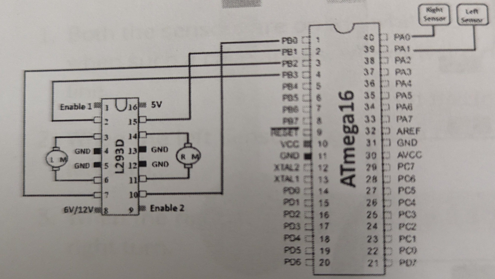

  <h1>Parveez Banu Syed Azizuddin</h1>
  
Mechatronics Engineer | Robotics & Embedded Systems | Automation Enthusiast

## About Me

I am a Mechatronics Engineer with hands-on experience in ROS 2, embedded systems, industrial automation, and robotics simulation. My projects showcase practical problem-solving skills, integrating hardware and software to develop autonomous and industrial systems.

---

## ROS2 Projects

   
### Wall Following Robot (ROS 2 + Gazebo)

Robot maintains a steady distance from walls using LiDAR and ROS 2 Humble + Gazebo Classic.

**Skills & Tools:** ROS 2 Humble, Python, Gazebo, URDF/Xacro, LiDAR

  <video controls><source src="assets/images/Wall_follower.mp4" type="video/mp4" /></video>
   
  <a class="github-link" href="https://github.com/parveezsyed28/Wall-Following-Robot-with-LiDAR" target="_blank">GitHub</a>

---
   
### Obstacle Avoidance Robot (ROS 2 + Gazebo)
Differential drive robot avoids obstacles dynamically in simulated environments.

**Skills & Tools:** ROS 2 Humble, Python, Gazebo, URDF/Xacro, LiDAR

  <video controls><source src="assets/images/Obstacle_Avoidance.mp4" type="video/mp4" /></video>
   
  <a class="github-link" href="https://github.com/parveezsyed28/obstacle_avoidance_lidar" target="_blank">GitHub</a>

---

### Robot Description & Simulation (ROS2 + Fusion 360)

Custom two-wheeled robot modeled in Fusion 360 and simulated in Gazebo with URDF/Xacro.

**Skills & Tools:** Fusion 360, ROS 2 Humble, Gazebo, URDF/Xacro

  <video controls><source src="assets/images/robot_teleop.mp4" type="video/mp4" /></video>

<a class="github-link" href="https://github.com/parveezsyed28/ros2_bot_description" target="_blank">GitHub</a>

---
   
### Turtlesim Geometric Shape Drawer

ROS 2 Python node draws shapes in Turtlesim based on user input.

**Skills & Tools:** ROS 2 Humble, Python, Turtlesim

  <video controls><source src="assets/images/Turtlesim.mp4" type="video/mp4" /></video>

<a class="github-link" href="https://github.com/parveezsyed28/user_input_turtle_shape" target="_blank">GitHub</a>

---

## Embedded Projects

   
### ADC-Based Robot

Obstacle avoidance, cliff detection, line following, and potentiometer-based speed control using ATmega16 ADC.

**Skills & Tools:** Embedded C, ATmega16, IR Sensors, L293D, Potentiometer

<a class="github-link" href="https://github.com/parveezsyed28/adc_speed_controlled_robot" target="_blank">GitHub</a>

---

### Obstacle Avoider Robot

IR sensor-based obstacle detection and motor control with ATmega16 microcontroller.

**Skills & Tools:** Embedded C, ATmega16, IR Sensors, L293D

  
  

<a class="github-link" href="https://github.com/parveezsyed28/obstacle_avoider_robot" target="_blank">GitHub</a>

---

### Table Top Robot

Edge-detection robot preventing falls, using IR sensors on ATmega16.

**Skills & Tools:** Embedded C, ATmega16, IR Sensors

  

<a class="github-link" href="https://github.com/parveezsyed28/table_top_robot" target="_blank">GitHub</a>

---

### Line Follower Robot

Black line following using bottom IR sensors, motor control via ATmega16 and L293D.

**Skills & Tools:** Embedded C, ATmega16, IR Sensors, L293D

  
  

<a class="github-link" href="https://github.com/parveezsyed28/line_follower_robot" target="_blank">GitHub</a>

---

## Industrial Automation Projects

### ABB RobotStudio + Teach Pendant

- **Pick & Place / Sorting Simulation**  
- **Drawing / Pattern Simulation**  
**Tools:** ABB RobotStudio, ABB Teach Pendant, TCP  
**Skills Learned:** Trajectory planning, TCP configuration, precise motion control

### Nachi Robot Teach Pendant

- **Pick & Place & Color Sorting**  
- **Drawing / Pattern Making**  
**Tools:** Nachi Teach Pendant, TCP  
**Skills Learned:** Motion sequences, sensor integration, TCP adjustments

### PLC Projects

- **Water Treatment Plant Backwash Automation**  
- **Small Foundry Energy Efficiency & QA Control**  
**Tools:** RSLogix 500 / Studio 5000, Ladder/Structured Text, PLCs  
**Skills Learned:** Sequence programming, interlock logic, process optimization

---

## Skills & Tools

ROS 2 Humble
Gazebo Classic
URDF / Xacro
Python
Embedded C
ATmega16
L293D Motor Driver
IR Sensors
Fusion 360
CAD Modeling
KiCad PCB Design
Linux (Ubuntu)
Git & GitHub
ABB RobotStudio
Nachi Teach Pendant
PLC Ladder Logic

---

## Contact

<a href="mailto:parveezbanu.s@gmail.com">Email</a>
<a href="https://github.com/parveezsyed28" target="_blank">GitHub</a>
<a href="https://linkedin.com/in/parveez-banu2807" target="_blank">LinkedIn</a>

